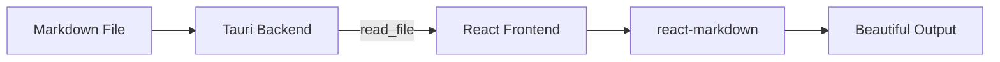

# MDViewer Feature Test

This document exercises every supported rendering feature.

## GFM: Tables

| Feature         | Status  | Notes                   |
|-----------------|---------|-------------------------|
| Tables          | Working | GFM tables              |
| Task lists      | Working | See below               |
| Strikethrough   | Working | ~~like this~~           |
| Autolinks       | Working | https://example.com     |

## GFM: Task Lists

- [x] Completed task
- [ ] Incomplete task
- [x] Another done item
- [ ] Another todo

## GFM: Footnotes

The quick brown fox[^fox] jumps over the lazy dog[^dog].

[^fox]: A fox is a small to medium-sized omnivorous mammal.
[^dog]: Dogs were domesticated from wolves around 15,000 years ago.

## Math (KaTeX)

Inline math: $E = mc^2$ and the Pythagorean theorem: $a^2 + b^2 = c^2$

Block math:

$$
\int_{-\infty}^{\infty} e^{-x^2}\, dx = \sqrt{\pi}
$$

$$
\sum_{n=1}^{\infty} \frac{1}{n^2} = \frac{\pi^2}{6}
$$

## Code Blocks

```python
def fibonacci(n: int) -> list[int]:
    """Generate Fibonacci sequence up to n terms."""
    seq = [0, 1]
    for _ in range(n - 2):
        seq.append(seq[-1] + seq[-2])
    return seq[:n]

print(fibonacci(10))
```

```javascript
const greet = (name) => {
  const message = `Hello, ${name}! 👋`;
  console.log(message);
  return message;
};
```

```rust
fn main() {
    let numbers = vec![1, 2, 3, 4, 5];
    let sum: i32 = numbers.iter().sum();
    println!("Sum: {sum}");
}
```

## Mermaid Diagram



## Callouts / Admonitions

:::note
This is a **note** callout. Great for adding context.
:::

:::tip
This is a **tip** callout. Use it to highlight helpful suggestions.
:::

:::warning
This is a **warning** callout. Something to be careful about.
:::

:::danger
This is a **danger** callout. Critical information goes here.
:::

:::important
This is an **important** callout. High priority information.
:::

## Emoji Shortcodes

:rocket: Launch! :tada: Celebrate! :sparkles: Magic! :heart: Love it!

:thumbsup: :fire: :bug: :bulb: :warning: :white_check_mark:

## Blockquotes

> "Design is not just what it looks like and feels like. Design is how it works."
>
> — Steve Jobs

Nested blockquote:

> First level
>> Second level — nested inside

## Definition Lists

Markdown
:   A lightweight markup language for creating formatted text using a plain-text editor.

Tauri
:   A framework for building tiny, blazing fast binaries for all major desktop platforms.

React
:   A JavaScript library for building user interfaces, developed by Meta.

## Images


## Horizontal Rule

---

## Heading Anchors

### Section Alpha

Click the heading to copy its anchor link.

### Section Beta

Another section with an anchor.

#### Deep Nesting Example

This is an `h4` heading.

## Inline Formatting

This paragraph has **bold text**, *italic text*, ~~strikethrough~~, and `inline code`.

You can combine **bold and _italic_** and even `code in **bold**` contexts.

## Long Paragraph (Typography Test)

Lorem ipsum dolor sit amet, consectetur adipiscing elit. Sed do eiusmod tempor incididunt ut labore et dolore magna aliqua. Ut enim ad minim veniam, quis nostrud exercitation ullamco laboris nisi ut aliquip ex ea commodo consequat. Duis aute irure dolor in reprehenderit in voluptate velit esse cillum dolore eu fugiat nulla pariatur. Excepteur sint occaecat cupidatat non proident, sunt in culpa qui officia deserunt mollit anim id est laborum.
